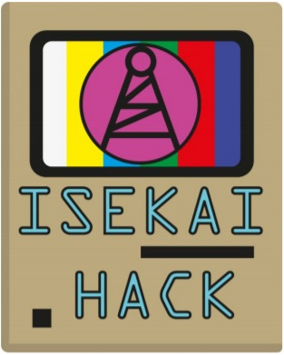

# Project 1

## Samurai Shodown

### Presentation:

Project 1 - Samurai Shodown

Samurai Shodown is a competitive fighting game series developed by SNK for the NEO GEO platform and got released the seventh of July, 1993.

The stories take place in the 18th century in Japan, during the seclusion period. Shiro Tokisada Amakusa was slain in 1638 by the forces of the Tokugawa Shogunate and he is revived as a satanic demon. Driven by his hate for the force that killed him, he uses his dark powers to bring chaos to the world.

## **Team members**

* Guillem Turmo (https://github.com/turmo11)- Management
* Santiago Moliner (https://github.com/sanmopre)- Programmer
* Marc Kenneth Dipasupi (https://github.com/marc535)- Art Design
* Òscar Tarrés (https://github.com/oscarta3)- Q&A

Controls:
If you wish to switch screens you can press SPACE
* Player1 - Gen-an:
To move Gen-an you have to either press D(forward walk), A(backward walk),W(jump) or S(crouch)
To attack with Gen-an you can either press Q(light attack), E(medium attack), or R(Poison attack) T(kick)
You can also combine walking with jumping to realize forward/backward jumps (A/D + W)

* Player2 - Gen-an:
To move Gen-an you have to, using the arrows, either press RIGHT(forward walk), LEFT(backward walk),UP(jump) or DOWN(crouch)
To attack with Gen-an you can either press 1(light attack), 2(medium attack), or 3(Poison attack) 4(kick)
You can also combine walking with jumping to realize forward/backward jumps (LEFT/RIGHT + UP)

* Debug tools
F1: show/hide colliders
F3: skip to battle
F5: godMode(eliminate p1 colliders)
F10: Player1 win
F11: Player2 win
1:Direct player1 win
2:Direct player2 win

List of Versions:

v.0.1: - Scrollable empty background

v.0.2:  - Included NeoGeo screen, Welcome screen, Haohmaru's stage(animated) and Celebration screen
	- FadeToBlack when screen switching added
	- Music added for each different screen
 	- Haohmaru added with idle, forward walk, backward walk and jump animation
	- Direct access to Haohmaru's scene by pressing Q (shortcut from NeoGeo's screen)

v.0.3:  - Two movable players added without collisions
	- Players flip when they pass each other, therefore, their animations flip as well
	- Animated kick and special attack mechanics
	- Added tornado particle
	- Added sound fx for kick and special attack (+tornado)

v.0.4:  - Camera limits implemented
	- Colliders for player and player2
	- Colliders for tornado(+ animation completed)
	- Colliders for walls/camera limits
	- F1 debug tool added (show collides)
	- F5 debug tool added godMode(eliminates only player's colliders)

v.0.5:  - Implemented the following animations:
		- Jump Forward/Backward
		- Crouch up/down
	- HP bars added(fully functional) that decrease when player gets hit
	- State/Input manager
	- Win/Lose situations included
	- Debug tools added directWin/Lose (player1/player2 victory) by pressing either 1 or 2, in all the screens
	- Skip to battle debug tool changed from Q to F2, and added to all the screens
	- Slash mechanic added, as well as its sfx
	- Getting hit sfx and animation added
	- Applied all changes to player2
	- Death animation

v.0.6:	- Implemented the following stage/screen animations:
		- Gen-an stage
		- NeoGeo screen
		- Welcome screen
	- Implemented gen-an + player2 gen-an with different color sprites
	- Implemented walk (forward and backward), jump (neutral, forward and backward) animations to gen-an
	- Introduced timer
	- Introduced KO animation(UI)
	- Added F3 debug tool (shortcut to gen-an stage)
	
v.Alpha:  - Haohmaru disabled
	  - Implemented Gen-an crouch (forward and backward), fixed jump (neutral, forward and backward) animations to gen-an
	  - Implemented Gen-an particles
	  - Implemented Gen-an new animations (kick, lightattack, medium attack)
	  
Link to the game's wiki: https://github.com/marc535/Project_1/wiki

Link to our latest release: 
